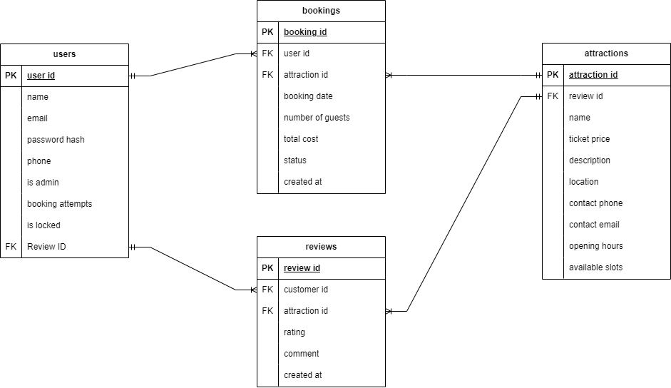
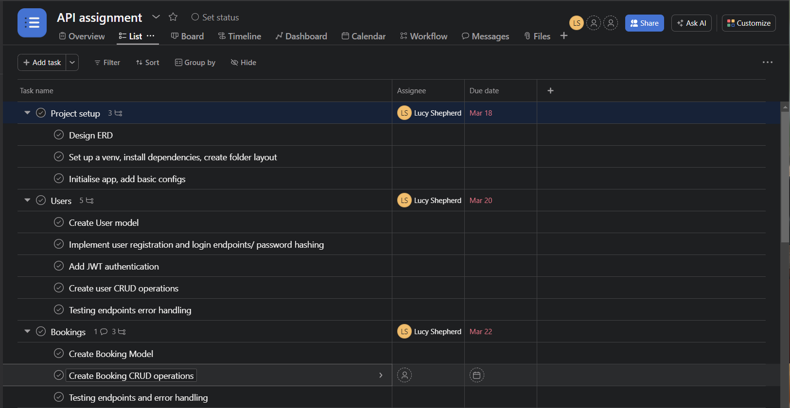
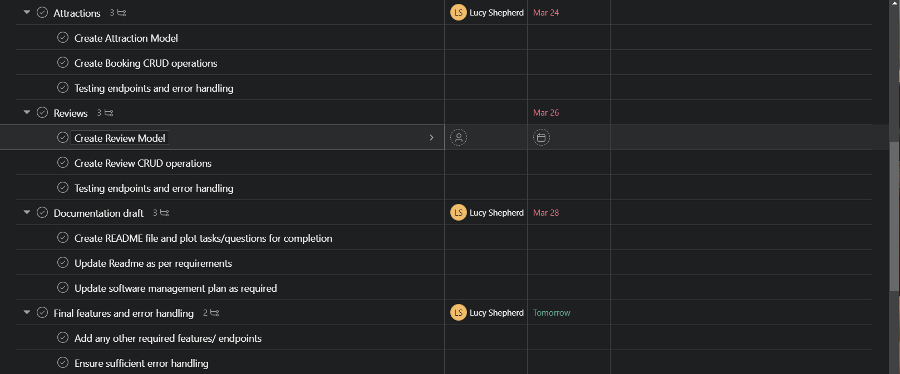
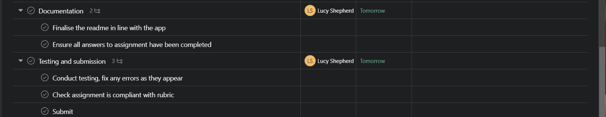

# Lucy Shepherd T2A2 - API 

[GITHUB- Attraction API](https://github.com/lushepherd/attraction_api)

## Menu

- [API Setup and Installation](#api-setup-and-installation)
- [Q1 Identification of the problem my app solves](#1---identification-of-the-problem-you-are-trying-to-solve-by-building-this-particular-app)
- [Q2 Why is it a problem that needs solving](#2---why-is-it-a-problem-that-needs-solving)
- [Q3 Why have I chosen this database and drawbacks](#3---why-have-you-chosen-this-database-system-what-are-the-drawbacks-compared-to-others)
- [Q4 Key functionalities and benefits of an ORM](#4---identify-and-discuss-the-key-functionalities-and-benefits-of-an-orm)
- [Q5- Endpoint Documentation](#5---document-all-endpoints-for-your-api)<br><br>
         <b>USERS</b><br>

    - [Register user](#register-user-endpoint---create-a-new-user-account-with-details-provided-by-client)
    - [Login user](#login-user-endpoint---log-in-an-already-registered-user)
    - [View all users (as admin)](#view-all-users-admin-only)
    - [View one user account (account holder or admin)](#view-account)
    - [Update Account](#update-account)
    - [Delete Account (account holder or admin)](#delete-account)<br>

    <b>BOOKINGS</b>
    - [Create Booking](#create-new-booking)
    - [Admin Create Booking on behalf of User](#admin-create-booking-for-user)
    - [View My Bookings](#view-my-bookings)
    - [Update Booking (admin only)](#update-booking-admin-only)
    - [Delete Booking (admin only)](#delete-account)

    <b>ATTRACTIONS</b>
    - [View All Attractions](#view-all-attractions)
    - [View One Attraction](#view-one-attraction)
    - [Create Attraction (admin only)](#create-attraction-admin-only)
    - [Update Attraction (admin only)](#update-attraction-admin-only)
    - [Delete Attraction (admin only)](#delete-attraction-admin-only)

    <b>REVIEWS</b>
    - [Create A Review](#create-a-review)
    - [View My Reviews](#view-my-reviews)
    - [Update A Review](#update-review)
    - [Delete A Review](#delete-reviews)
- [Q6 ERD](#6---an-erd-for-your-app)
- [Q7 Third Party Servies Used by my APP](#7---detail-any-third-party-services-that-your-app-will-use)
- [Q8 Description of my Projects Models](#8---describe-your-projects-models-in-terms-of-the-relationships-they-have-with-each-other)
- [Q9 Database Relations](#9---discuss-the-database-relations-to-be-implemented-in-your-application)
- [Q10 Software Development Plan](#10---describe-the-way-tasks-are-allocated-and-tracked-in-your-project)
- [Resources](#resources)

### API Setup and Installation

1. Navigate to the src folder.
2. Create a database and user with the necessary permissions. The user will need to have ownership rights.
3. Create a .env file based on the provided .env.sample file in the src folder.
4. Create and activate a virtual environment 
```
python3 -m venv .venv

source .venv/bin/activate
```
5. Install dependencies from requirements.txt
```
pip3 install -r requirements.txt
```
6. Create tables
```
flask db create
```
7. Seed tables
```
flask db seed
```
8. Start the Flask server
```
flask run
```
For further instructions on usage, please navigate to [Endpoints](#5---document-all-endpoints-for-your-api) below.

### 1 - Identification of the problem you are trying to solve by building this particular app.

Planning visits to various attractions usually means having to look through many different websites and platforms. Seeing this issue as an inconvenience for users, the creation of an API for a booking app is a solution aimed at making things easier for users in several ways.

This is designed to function as a centralised booking system. By bringing together the booking process for a range of attractions into one platform, it makes things simpler for users. This means users no longer need to waste time checking multiple sites to plan their visits, making the journey from being interested in an attraction to actually booking a smoother experience.

It allows real-time availability information ensuring that planning trips and visits is easier and more efficient, allowing for smooth scheduling.

Another important feature is a streamlined review system. Usually, potential visitors have to search through several platforms to find reviews about an attraction. This app puts all these reviews in one place, letting users access other users experiences and insights. This helps users make informed decisions quickly, improving the planning process.

Verified user feedback is another design feature. Users with confirmed bookings that have been completed are able to leave feedback in the form of reviews and ratings. This serves two purposes: it gives attractions valuable insights for improvement and helps future visitors make choices.

Communication between users and attractions is helpful for sorting out questions or issues related to bookings. The app addresses this by creating a direct line of communication, making it easy to get in touch. This makes solving booking-related issues more efficient and also improves the user experience by ensuring help is easy to seek out when required.

Lastly, the app can allow users to discover attractions they may not have heard of by viewing all attractions. This gives users more choices and may lead to them discovering new favourites.

This API tackles these challenges with a comprehensive set of features. It enhances the users journey with efficiency and access to a wider range of attractions. It can function as a key tool in making the planning of activities simpler and the booking process more enjoyable.

### 2 - Why is it a problem that needs solving?

 - Time Consumption: Users can waste time navigating multiple websites and platforms to find and book attractions. It is a disjointed approach that complicates the planning process and can increase the likelihood of missing out on better options or deals. This can eradicate extra time consumption and save users time and simplify the decision-making process.

- Attraction Information: With all attraction information in one location, users are able to check location and opening hour information and if there is availability for the number of people for their booking. 

- Decision-Making: The verified review system allows convenient access to user experiences from users with completed bookings. This can assist with informed decision making at the time of booking (and users can also add their own ratings and reviews after attending).

- Communication: Direct communication with attractions for inquiries or booking changes allows efficient communication between user and attraction. This can enhances user satisfaction and trust in the service.

- Attraction Visibility: By offering a platform that hosts a wide range of attractions, it can help diversify user choices and potentially support smaller or lesser-known attractions in gaining visibility.

- Expanding Range - As an admin has the ability to create new attractions, the available range of attraction choices can continue to expand. This means users can continue to discover new attractions and may be more likely to be repeat customers in the future.  

###  3 - Why have you chosen this database system. What are the drawbacks compared to others?

#### Why I chose SQLAlchemy

- Easy to Start: I have found it's a simple process to get it up and running. As a new and learning developer I found it great to get this project off the ground without a lot of fuss over database setup.

- Works Well with Python and Flask: Lets me define the database in terms I'm familiar with (like Python classes), which made working with it and adapting it to my needs a straightforward process.

- Saves Time Writing Code: I found SQLAlchemy took care of a lot of the complex/repetitiveness that comes with dealing with databases. It abstracts database operations you don't need to write raw SQL queries which means writing less code, and the code have written is cleaner and easier to understand.

- Good Easy-to-read Docs: I found the documentation really easy to follow and it seemed to be easy to find solutions to errors that popped up. It was also easy to find examples of different ways to accomplish a task.

- Good for Work Experience - This is more of a general reason rather than related to this application, but I have found looking at jobs in tech/IT a lot of them require proven experience in SQLAlchemy as it is such a popular choice even today.

#### Some Drawbacks of using SQLAlchemy
For this assignment I didn't experience many drawbacks so I did some research to find some reasons why others think it may not be the best choice. I have found the main complaint is slowing down your application so I looked into how/why this happens.

SQLAlchemy works by putting a layer called Object-Relational Mapping (ORM) between your app and the database. This layer changes the Python code you write into SQL commands for the database and then turns the database's answers back into Python. This is meant to make things easier and keep your code tidy.

This extra step can make things slower and give you less direct control over the database. Whether this is a big deal depends on project needs and how fast you need your app to run. I have seen it mentioned also you can use SQLAlchemy for general things and switch to direct SQL commands when you need things to be faster.

Another reason that can affect performance is broad queries that return a large amount of data when only a small amount is needed. I have seen fixes to this including utilising more specific queries to return only the column required instead of a whole table, or using lazy loading which will prevent an attribute from loading on object instantiation - this means it won't load related tables unless they required. 

Another potential drawback I have seen I actually listed as a pro above (for myself). For someone who already knows SQL well SQLAlchemy’s way of handling things might feel limiting as it hides some of the complexities of SQL.

### 4 - Identify and discuss the key functionalities and benefits of an ORM

An Object-Relational Mapping (ORM) tool allows developers to manage and interact with relational databases in a simpler way. It acts as a bridge between the application code and the database. 

<u>Some key functionalities are:</u> <br><br>
- Simplification: ORM abstracts the database schema and operations into objects. This hides the complexity of SQL queries and database schema details and assists with easier code management and understanding. This can also assist with reducing errors in database operations.

- CRUD Operations: ORM frameworks provide simple methods for performing Create, Read, Update, and Delete operations on databases. These operations are fundamental to managing database records, and ORM simplifies their execution without needing to use SQL queries.

- Data Type Mapping: ORMs automatically map database data types to programming language data types, ensuring seamless data conversion. This mapping eliminates the need for manual conversion, reducing errors and workload.

- Relationship Management: ORM frameworks manage relationships between different data models (ie one-to-one, one-to-many, many-to-many relationships) through object references. This makes it easier to navigate related data without complex SQL joins.

<u>Some Benefits of Using an ORM:</u><br>
- Increased Productivity: ORM's automate a lot of routine database operations which allows developers to focus more on business logic rather than database management.

- Code Maintainability: As an ORM handles a lot of the more complex queries code is much cleaner/simpler. This means changes to the database model or structure can be managed efficiently, making the codebase easier to maintain and evolve.

- Enhanced App Performance: Through features like lazy loading and caching, ORM frameworks can optimise databases and reduce the load on the database server, leading to improved application performance.

- Easier Transaction Management: ORM frameworks often provide simplified mechanisms for managing transactions, ensuring data integrity and consistency even across complex operations involving multiple tables.

### 5 - Document all endpoints for your API

### Users

#### Register User Endpoint - Create a new user account with details provided by client.

- <b>HTTP Method</b>: POST<br>
- <b>URL:</b> /auth/register<br>
- No permissions required

Allows a user to register an account.

Request body: JSON object with the following keys:

- name: Users full name. Must contain only letters, spaces, and dashes.
- email: Users email address. Must be in a valid email format.
- phone: Users phone number. Must contain exactly 10 characters.
- password: Users desired password. Must contain a minimum of 8 characters.

Example:
```json
{
  "name": "John Smith",
  "email": "smith.john@email.com",
  "phone": "0412345600",
  "password": "password"
}
```
<b>Success Response</b>
- Code 201 (created)
- Returns created user object (without the password)

Example Success Response:
```json
{
  "id": 3,
  "name": "John Smith",
  "email": "smith.john@email.com",
  "phone": "0412345600",
  "is_locked_out": false,
  "is_admin": false,
  "bookings": [],
  "reviews": []
}
```
Error Responses
Validation Error
- Code: 400 Bad Request
- Content: Error message detailing missing or invalid fields.
Example Validation Error Response:
```json
  {
  "error": {
    "name": [
      "Name cannot be empty.",
    ],
    "email": [
      "Not a valid email address."
    ]
  }
}
```
Integrity Errors
- Code: 400 Bad Request 
 - Content: A message indicating that a required field is missing or invalid.
 - Example NOT NULL Violation Response and Validation Error Response:
```json
  {
  "error": {
    "email": [
      "Not a valid email address."
    ]
  }
}
```
```json
{
  "error": {
    "password": [
      "Password must be at least 8 characters long."
    ]
  }
}
```
Unique Violations
 - Code: 409 Conflict (for UNIQUE violations)
- Content: A message indicating that the provided email address or phone number is already in use.
 - Example UNIQUE Violation Response (Email, Phone):
```json
{
  "error": "Email address already in use"
}
```
```json
{
  "error": "Phone number already in use"
}
```

<b>Further Notes</b><br>
- All fields (name, email, phone, password) are required. If any are missing or don't meet the validation criteria, a 400 Bad Request error will be returned with details.
- The password is hashed for security before being stored in the database.
- The email address and phone number must be unique. Attempting to register with an email address or phone number that is already in use will result in a 409 Conflict error.
- User can't see the is_admin or is_locked_out flags

#### Login User Endpoint - Log in an already registered user

- <b>HTTP Method</b>: POST<br>
- <b>URL:</b> /auth/login<br>
- <b>Authentication Required:</b> No<br>

Login a user that already has an account.

<b>Request body</b>: JSON object with the following keys:

- email: The user's email address
- password: The user's password

Example:
```json
{
  "email": "smith.john@email.com",
  "password": "password"
}
```
<b>Success Response</b>
- Code 200 (OK)
- Returns email, token, and if the user is an admin or not

Example Success Response:
```json
{
  "email": "smith.john@email.com",
  "token": "eyJhbGciOiJIUzI1NiIsInR5cCI6IkpXVCJ9...",
  "is_admin": false
}
```
Error Response
1. Code: 401 Unauthorized (email or password incorrect)
    .
Example Validation Error Response:
```json
{
  "error": "401 Unauthorized: The server could not verify that you are authorized to access the URL requested. You either supplied the wrong credentials (e.g. a bad password), or your browser doesn't understand how to supply the credentials required."
}
```
#### View All Users (admin only)

- <b>HTTP Method</b>: GET<br>
- <b>URL:</b> /auth/users<br>
- <b>Authentication Required:</b> Yes, a valid JWT token must be used in Authorisation header.
- <b>Permissions:</b> Admin only.

Allows an admin to retrieve all users on the database along with their reviews and bookings. Admin can also see if another user is admin or if they are locked out of their account.

<b>Success Response</b>
- Code 200 (OK)
- Returns list of all registered users, their bookings and their reviews.

Example Success Response:
```json
[
  {
    "id": 1,
    "name": "Admin One",
    "email": "admin@email.com",
    "phone": "0455555555",
    "is_locked_out": false,
    "is_admin": true,
    "bookings": [
      {
        "id": 2,
        "attraction": {
          "name": "Story Bridge Adventure Climb"
        },
        "booking_date": "25/07/2024",
        "number_of_guests": 4,
        "total_cost": 280.0,
        "status": "Requested",
        "created_at": "31/03/2024"
      }
    ],
    "reviews": [
      {
        "id": 2,
        "attraction": {
          "name": "Story Bridge Adventure Climb"
        },
        "rating": 10,
        "comment": "Best day of my life!",
        "created_at": "31-03-2024",
        "user": {
          "name": "Admin One"
        }
      }
    ]
  },
  {
    "id": 2,
    "name": "User One",
    "email": "user1@email.com",
    "phone": "0466666666",
    "is_locked_out": false,
    "is_admin": false,
    "bookings": [
      {
        "id": 1,
        "attraction": {
          "name": "The Wheel of Brisbane"
        },
        "booking_date": "20/05/2023",
        "number_of_guests": 2,
        "total_cost": 80.0,
        "status": "Confirmed",
        "created_at": "31/03/2024"
      }
    ],
    "reviews": [
      {
        "id": 3,
        "attraction": {
          "name": "The Wheel of Brisbane"
        },
        "rating": 1,
        "comment": "HATE",
        "created_at": "31-03-2024",
        "user": {
          "name": "User One"
        }
      }
    ]
  },
```
Error Response
1. Code: 401 Unauthorized (user not authenticated or token is invalid)

Example Validation Error Response:
```json
{
    "error": "Not authorised. Admin access required."
}
```
#### View Account

- <b>HTTP Method</b>: GET<br>
- <b>URL:</b> /auth/users/<user_id><br>
- <b>Authentication Required:</b> Yes, a valid JWT token must be used in Authorisation header.<br>
- <b>Permissions:</b> Account user can view their own account, admin can view any account.

<b>Success Response</b>
- Code 200 (OK)

Example Success Response:

```json
{
  "id": 4,
  "name": "John Smith",
  "email": "smith.john@email.com",
  "phone": "0412345600",
  "is_admin": false,
  "bookings": [],
  "reviews": []
}
```
Error Responses

- Code: 401 Unauthorized (user is not authenticated or token is invalid)
- Code: 403 Forbidden (user is not account holder or admin)
- Code: 404 Not Found (user with specified ID doesn't exist)

Example:
```json
{
  "error": "403 Forbidden: You don't have the permission to access the requested resource. It is either read-protected or not readable by the server."
}
```

#### Update Account

- <b>HTTP Method</b>: PUT<br>
- <b>URL:</b> /auth/update <br>
- <b>Authentication Required:</b> Yes, a valid JWT token must be used in Authorisation header.<br>
- <b>Permissions:</b> Only account user can update their account.

<b>Request Body:</b> JSON object containing any of the fields that the user wishes to update: name, email, phone, and password. Fields not provided will retain their existing values. Follows same data validation as "register user".

- name: Users full name. Must contain only letters, spaces, and dashes.
- email: Users email address. Must be in a valid email format.
- phone: Users phone number. Must contain exactly 10 characters.
- password: Users desired password. Must contain a minimum of 8 characters.

Example:
```json
{
  "email": "mrjohnsmith@email.com"
}
```
<b>Success Response</b>
- Code 200 (OK)
Example Success Response:
```json
{
  "id": 4,
  "name": "John Smith",
  "email": "mrjohnsmith@email.com",
  "phone": "0412345600",
  "is_admin": false,
  "bookings": [],
  "reviews": []
}
```
Error Responses

- Code: 401 Unauthorized (user is not authenticated or token is invalid)
- Code: 404 Not Found (user with specified JWT doesn't exist)
- Code: 400 Bad Request (detailed error message will indicate which fields are invalid or improperly formatted)

Example:
```json
{
    "error": "User not found"
}
```
```json
{
  "name": [
    "Name can't contain special characters."
  ]
}
```
#### Delete Account

- <b>HTTP Method</b>: DELETE<br>
- <b>URL:</b> /auth/delete/<user_id><br>
- <b>Authentication Required:</b> Yes, a valid JWT token must be used in Authorisation header.<br>
- <b>Permissions:</b> Admins can delete any user account, user can delete their own account.

<b>Success Response:</b>
Code 200 (OK)<br>
Example Success Response:
```json
{
    "message": "User deleted successfully"
}
```
Error Responses
- Code 401 Unauthorized: user is not authenticated or the token is invalid
- Code 403 Forbidden: requesting user is not authorised to delete the account.

Example:
```json
{
    "error": "Unauthorised"
}
```
- Code 404 Not Found: user with specified ID does not exist.

Example:
```json
{
  "error": "404 Not Found: The requested URL was not found on the server. If you entered the URL manually please check your spelling and try again."
}
```
#### Unlock Account (as admin)

- <b>HTTP Method</b>: POST<br>
- <b>URL:</b> http://localhost:8080/auth/unlock_user/2 (number as user ID to unlock)<br>
- <b>Authentication Required:</b> Yes, a valid JWT token must be used in Authorisation header.<br>
- <b>Permissions:</b> Only admin can unlock an account.

Used for fraud prevention. A user can be locked out of their account for a couple of reasons:
- They have 5 bookings in the past 24hrs with the status 'Requested'
- They have bookings totaling more than $2500 for the same time period.

Admin can retrieve a user to see if their account is locked. is_locked_out will show as "true" or "false". Once the account is unlocked, depending on the reason for the lock: A user won't be able to make another booking until admin updates the status of one or more bookings to Confirmed or Canceled, or 24hrs has passed until they can make another booking over the $2500 limit.

```json
{
  "id": 3,
  "name": "John Smith",
  "email": "mrjohnsmith@email.com",
  "phone": "0417987696",
  "is_locked_out": true,
  "is_admin": false,
  "bookings": 
```
Success Response

Code 200 (OK)

Example success response:
```json
{
  "message": "User account 3 unlocked successfully"
}
```
Retrieving the user account should now show as is_locked_out = false.
```json
{
  "id": 3,
  "name": "John Smith",
  "email": "mrjohnsmith@email.com",
  "phone": "0417987696",
  "is_locked_out": false,
  "is_admin": false,
  "bookings":
```
#### Create New Booking

- <b>HTTP Method</b>: POST<br>
- <b>URL:</b> /booking/new<br>
- <b>Authentication Required:</b> Yes, a valid JWT token must be used in Authorisation header. <br>
- <b>Permissions:</b> Only account user owner can create a booking.

<b>Request Body:</b> JSON object containing booking details. 
- id: Attraction ID as an integer.
- booking_date: Australian date format DD-MM-YYYY. Must be dated between today and 6 months from now.
- number_of_guests: as an integer - can only be between 1 and 20.

Example:
```json
{
  "id": 1, 
  "booking_date": "10-04-2024",  
  "number_of_guests": 2
    }
```

<b>Success Response</b>
- Code 201 (Created)
Example Success Response:
```json
{
  "id": 3,
  "attraction": {
    "name": "The Great Wall of China"
  },
  "booking_date": "30/05/2024",
  "number_of_guests": 5,
  "total_cost": 750.0,
  "status": "Requested",
  "created_at": "31/03/2024",
  "user": {
    "name": "John Smith",
    "email": "mrjohnsmith@email.com",
    "phone": "0417987696"
  }
}
```

Error Responses
- Code: 400 Bad Request (For invalid request parameters or booking constraints exceeded)
```json
{
  "message": "Invalid booking date format. Enter as DD-MM-YYYY."
}
```
```json
{
  "message": "For bookings greater than 20, please contact the attraction directly."
}
```
- Code: 403 Forbidden (When trying to create a booking over $1000 without admin permissions)
```json
{
  "message": "Bookings over $1000 require admin permission."
}
```
- Code: 429 Too Many Requests (When account is locked due to security reasons)
```json
{
  "message": "Account locked for security reasons. Please contact admin."
}
```

- Code: 404 Not Found (When the specified attraction ID does not exist)
Content: { "error": "Attraction not found" }

Example:
```json
{
    "error": "User not found"
}
```
```json
{
  "name": [
    "Name can't contain special characters."
  ]
}
```
Further notes:
- Bookings are subject to validation checks including date format, date range (booking must be within 6 months from today), and attraction slot availability.
- Security checks are in place to reduce instances of fraud. 
    - Users need admin permission for bookings of $1000 or more
    - Users accounts are locked if they create more than 5 bookings or exceed total cost of $2500 in a 24hr period. Account can only be unlocked by an admin (in a real life scenario, admin would verify the bookings then confirm them and unlock the account, or cancel the bookings and keep account locked)
    - If a user requires another booking, admin can confirm or cancel current bookings and unlock their account.
    - If a user requires a booking exceeding $1000,  admin can create a booking on their behalf.
    - Bookings for 20 or more people are not allowed.
- When bookings are created, the number of guests for the new booking is deducted from the attraction availability to avoid overbooking.

#### Admin Create Booking for User

- <b>HTTP Method</b>: POST<br>
- <b>URL:</b> /booking/admin/<user_id><br>
- <b>Authentication Required:</b> Yes, a valid JWT token must be used in Authorisation header.
- <b>Permissions:</b> Only account user owner can create a booking.

Request Body: JSON object containing booking details. 
- id: Attraction ID as an integer.
- booking_date: Australian date format DD-MM-YYYY. Must be dated between today and 6 months from now.
- number_of_guests: as an integer - can only be between 1 and 20.

Follows the same logic as create a booking, however an admin can enter the user id and create a booking exceeding the $1000 limit on their behalf. Would also be used in a case where potentially users don't want to or aren't able to make their own bookings - they can phone/email and an admin can create a for them without accessing the users actual account.<br>

<b>Success Response</b>
- Code 201 (Created)
Example Success Response:
```json
{
  "id": 15,
  "attraction": {
    "name": "The Great Wall of China"
  },
  "booking_date": "30/06/2024",
  "number_of_guests": 10,
  "total_cost": 1500.0,
  "status": "Requested",
  "created_at": "31/03/2024",
  "user": {
    "name": "John Smith",
    "email": "mrjohnsmith@email.com",
    "phone": "0417987696"
  }
}
```
Error Response:
- Code: 400 Bad Request (missing required fields, JSON payload incorrectly configured)

Examples:
```json
{
  "error": "400 Bad Request: The browser (or proxy) sent a request that this server could not understand."
}
```
Code 403: Forbidden (non admin user attempting booking)
```json
{
  "error": "Not authorised. Admin access required."
}
```
Further Notes:
- Admin can't make bookings for someone with a locked account, account must be unlocked. If account was locked due to having 5 bookings in requested, admin must confirm or cancel one or more bookings to make an additional booking. Locked accounts will return the following error:

```json
{
  "message": "Account locked for security reasons. Please contact admin."
}
```
- Admin unlocking an account and then making a booking without changing a booking status will lock the account again.

#### View My Bookings

- <b>HTTP Method</b>: GET<br>
- <b>URL:</b> /booking/my_bookings<br>
- <b>Authentication Required:</b> Yes, a valid JWT token must be used in Authorisation header.<br>
- <b>Permissions:</b> Only account user owner can access this endpoint to view their own bookings.

Logged in user can view all of their bookings.

Success Response
Code 200 (OK)

Example:
```json
{
    "id": 15,
    "attraction": {
      "name": "The Great Wall of China"
    },
    "booking_date": "30/06/2024",
    "number_of_guests": 10,
    "total_cost": 1500.0,
    "status": "Requested",
    "created_at": "31/03/2024",
    "user": {
      "name": "John Smith",
      "email": "mrjohnsmith@email.com",
      "phone": "0417987696"
    }
```
Error Responses:
Code: 401 Unauthorized

This error occurs if the JWT token is missing, expired, or invalid.

If a user has no bookings, it will return 
```json
[]
```
Further notes:<br>
If an admin needs to view all bookings for a user, they would view a user account via auth/user/2 (number is user id) or they can retrieve all user accounts and all bookings via auth/users.

#### Update Booking (admin only)

- <b>HTTP Method</b>: PUT<br>
- <b>URL:</b> http://localhost:8080/booking/6 (integer = booking id)<br>
- <b>Authentication Required:</b> Yes - admin only.<vr>
- <b>Permissions:</b> Admins can update bookings for any user.

Admin can update the booking date, number of guests, and booking status for a user. In a real life scenario - an admin would likely need permission from the attraction to confirm or cancel a booking, update the booking date or add/remove guests (or they would admin their own attractions for approvals and amendments directly). One or more fields below are required.<br>
If the number of guests are increased or decreased, the available slots on the attraction adjusts accordingly.

Request body:
- booking_date (optional): The new booking date in DD-MM-YYYY format.
- number_of_guests (optional): The updated number of guests for the booking.
- status (optional): The new status of the booking (one of "Requested", "Confirmed", or "Cancelled").

Success Response
Code 200 (OK)

Example:

```json
{
  "id": 17,
  "attraction": {
    "name": "The Great Wall of China"
  },
  "booking_date": "30/06/2024",
  "number_of_guests": 2,
  "total_cost": 300.0,
  "status": "Confirmed",
  "created_at": "31/03/2024",
  "user": {
    "name": "John Smith",
    "email": "mrjohnsmith@email.com",
    "phone": "0417987696"
  }
}
```
Error Responses:

- Code: 404 Not Found (booking doesn't exist)
```json
{
  "error": "404 Not Found: The requested URL was not found on the server. If you entered the URL manually please check your spelling and try again."
}
```
- 400 Bad Request (invalid booking date format)
```json
{
  "message": "Invalid booking date format. Enter as DD-MM-YYYY."
}
```

Code: 400 Bad Request (not enough attraction availablility for booking)
```json
{
"error": "Not enough availability for the updated number of guests."
}
```
Code: 422 Unprocessable Entity (valid status wasn't provided)
```json
{
  "error": "Invalid status value",
  "message": "Status can only be 'Requested', 'Confirmed', or 'Cancelled'."
}
```
#### Delete Booking (admin only)
- <b>HTTP Method</b>: DELETE<br>
- <b>URL:</b> /booking/delete/<booking_id><br>
- <b>Authentication Required:</b> Yes - admin only.<vr>
- <b>Permissions:</b> Admins can delete bookings for any user.

Only an admin can delete a booking. The assumption is they will either require permission from the attraction.

Success Response: 
- Code 200 (ok)

Example:
```json
{
  "message": "Booking deleted successfully"
}
```
Error Response:
- Code 404 Not Found (Booking doesn't exist)
```json
{
  "error": "404 Not Found: The requested URL was not found on the server. If you entered the URL manually please check your spelling and try again."
}
```
- Code 403 Forbidden (user trying to delete doesn't have admin privileges)
```json
{
  "error": "Not authorised. Admin access required."
}
```
#### View All Attractions
- HTTP Method: GET
- URL: http://localhost:8080/attraction/all
- Authentication Required: No
- Permissions: None required. Open to all users including guests.

Retrieves a list of all attractions available. It does not require any authentication, making the information accessible to both authenticated users and guests. The attractions are ordered by their names to facilitate easy browsing.

Success Response
Code 200 (OK)

Example success response:
```json
{
    "id": 2,
    "name": "The Colosseum",
    "average_rating": "10.0",
    "ticket_price": 70.0,
    "location": "Rome, Italy",
    "description": "Oval amphitheatre in the centre of Rome, Italy.",
    "contact_phone": "0456733331",
    "contact_email": "colosseum@email.com",
    "opening_hours": "10:00 - 23:00",
    "available_slots": 100,
    "reviews": [
      {
        "rating": 10,
        "comment": "Best day of my life!",
        "created_at": "31/03/2024",
        "user": {
          "name": "Admin One"
        }
```
#### View One Attraction
- HTTP Method: GET
- URL: /attraction/<attraction_id>
- Authentication Required: No
- Permissions: None required. Open to all users including guests.

Retrieves one attraction. It does not require any authentication, making the information accessible to both authenticated users and guests. Useful for viewing detailed information for attraction, reviews etc.

Success Response
Code 200 (OK)

Example success response:
```json
{
    "id": 2,
    "name": "The Colosseum",
    "average_rating": "10.0",
    "ticket_price": 70.0,
    "location": "Rome, Italy",
    "description": "Oval amphitheatre in the centre of Rome, Italy.",
    "contact_phone": "0456733331",
    "contact_email": "colosseum@email.com",
    "opening_hours": "10:00 - 23:00",
    "available_slots": 100,
    "reviews": [
      {
        "rating": 10,
        "comment": "Best day of my life!",
        "created_at": "31/03/2024",
        "user": {
          "name": "Admin One"
        }
```
#### Create Attraction (admin only)
- HTTP Method: POST
- URL: /attractions/create
- Authentication Required: Yes, admin only
- Permissions: Only admin can create a new attraction.

Admin can create new attractions. The only unique constraint is the name, as a company with the same email address and phone can own more than one attraction.

Request body:
The request must include a JSON object with the following fields:

- name: The name of the attraction (must be unique).
- ticket_price: The price of a ticket (float)
- description: A brief description of the attraction (200 character limit)
- location: The location of the attraction.
- contact_phone: A phone number for inquiries (10 character limit)
- contact_email: An email address for inquiries (must be valid email format)
- opening_hours: The opening hours, formatted as 'HH:MM - HH:MM'.
- available_slots: The number of available slots for booking (int)

Example Request Body:
```json
{
  "name": "The Wheel of Brisbane", 
  "ticket_price": 40.0,
  "description": "Iconic landmark on South Bank.",
  "location": "Brisbane",
  "contact_phone": "0456745551",
  "contact_email": "brisbanewheel@email.com",
  "opening_hours": "10:00-21:00",
  "available_slots": 100
}
```

Success Response
Code 200 (OK)

Example success response:
```json
 {
    "id": 6,
    "name": "The Wheel of Brisbane",
    "average_rating": "0.0",
    "ticket_price": 40.0,
    "location": "Brisbane",
    "description": "Iconic landmark on South Bank.",
    "contact_phone": "0790000000",
    "contact_email": "wheel@email.com",
    "opening_hours": "10:00-20:00",
    "available_slots": 30,
    "reviews": []
  }
]
```
Error Responses:
- Code: 400 Bad Request (missing or invalid fields in the request body)
```json
{
  "error": {
    "opening_hours": [
      "Opening hours must be in the format 'HH:MM - HH:MM' using 24-hour time."
    ]
  }
}
```
```json
{
  "error": {
    "description": [
      "Maximum of 200 characters."
    ]
  }
}
```
```json
{
  "error": {
    "contact_email": [
      "Not a valid email address."
    ]
  }
}
```
```json
{
  "error": {
    "contact_phone": [
      "Phone number must contain 10 characters."
    ]
  }
}
```
- Code: 401 Unauthorized (user not authenticated)
- Code: 403 Forbidden (user is authenticated but does not have admin privileges)
```json
{
  "error": "Not authorised. Admin access required."
}
```
- Code: 409 Conflict (an attraction with the same name already exists)
```json
{
  "error": "An attraction with this name already exists."
}
```
#### Update Attraction (admin only)

- HTTP Method: PUT
- URL: /attractions/update/<attraction_id>
Authentication Required: Yes, admin privileges required.

Allows admins to update the details of an existing attraction. Partial updates are supported, meaning not all fields need to be included in the request.

Request Body (JSON): Fields are optional unless stated otherwise. All must follow same parameters as the create fields.

- name: The new name of the attraction (must be unique)
- description: Updated description of the attraction (max 200 characters).
- ticket_price: New ticket price
- location: The updated location
- contact_phone: New contact phone number (must  be 10 digits)
- contact_email: Updated email address (must be valid email format)
- opening_hours: The new opening hours, in "HH:MM - HH:MM" format
- available_slots: Updated number of available slots

Success Response:

Code: 200 OK
Content: Updated attraction details.
Example Request:
```json
{
  "id": 25,
  "name": "The Wheel of Brisbane",
  "average_rating": "0.0",
  "ticket_price": 40.0,
  "location": "Brisbane",
  "description": "Iconic landmark on South Bank.",
  "contact_phone": "0456745551",
  "contact_email": "brisbanewheel@email.com",
  "opening_hours": "10:00-21:00",
  "available_slots": 100,
  "reviews": []
}
```
Error Responses:

Code: 404 Not Found (attraction doesn't exist)
```json
{
  "error": "Attraction with id 250 not found"
}
```
Other error responses available on [Create Attraction](#create-attraction-admin-only).
#### Delete Attraction (admin only)
HTTP Method: DELETE<br>
URL: /attraction/delete/<attraction_id><br>
Authentication Required: Yes, admin only.
Permissions: Only admins can delete attractions.
This endpoint allows an admin to delete an attraction identified by its ID. On successful deletion, it returns a message confirming the action.

Success Response:
Code: 200 (OK)
```json
{
  "message": "Attraction 'The Wheel of Brisbane' deleted successfully"
}
```
Error Response:
Code: 404 (attraction with ID doesn't exist)
```json
{
  "message": "The requested attraction does not exist"
}
```
#### Create A Review

- HTTP Method: POST
- URL: /review/create/<attraction_id>
- Authentication Required: Yes, a valid JWT token must be used in Authorization header.<br>
- Permissions: User must have a confirmed past booking for the attraction.

This endpoint will check if a user has had a previous confirmed booking at the attraction and if they have previously left a review before allowing one to be created. This means reviews are more likely to be genuine and stop spam.

Request Body:

- rating: The rating given to the attraction (integer, must be between 1 and 10)
comment: The comment about the experience. (optional, 100 character limit.)

```json
{
  "rating": 7,
  "comment": "Amazing experience, highly recommend visiting!"
}
```
Success Response:
- Code: 201 (OK)

Example:
```json
{
  "message": "Review successfully added"
}
```
Error Responses:

- Code: 403 Forbidden (no confirmed past booking)
```json
{
  "error": "No confirmed booking for this attraction"
}
```
Code: 400 Bad Request (invalid or missing fields)
```json
{
  "error": {
    "comment": [
      "Exceeds 100 character limit."
    ]
  }
}
```

#### View My Reviews
- HTTP Method: GET
- URL: http://localhost:8080/review/my_reviews
- Authentication Required: Yes
- Permissions: User can view their own reviews.

Retrieves reviews for the current logged in user.

Success Response
- Code: 200 (OK)

Example:
```json
[
  {
    "id": 1,
    "attraction": {
      "name": "The Wheel of Brisbane"
    },
    "rating": 7,
    "comment": "Was really busy, long queues",
    "created_at": "31/03/2024",
    "user": {
      "name": "User One"
    }
  }
]
```
Error Responses:

- Code: 401 Unauthorized (Missing Authorization Header")
- Code: 422 Unprocessable Entity (token has expired)

#### Update Review
- HTTP Method: POST
- URL: http://localhost:8080/review/update/<review_id>
- Authentication Required: Yes
- Permissions: User can update their own reviews.

Allows for the current logged in user to update a review they have posted. Allows for partial updates - the rating or comment can be updated on their own.

Success Response
- Code: 200 (OK)
```json
{
  "id": 1,
  "attraction": {
    "name": "The Wheel of Brisbane"
  },
  "rating": 2,
  "comment": "Changed my mind, hated it",
  "created_at": "31/03/2024",
  "user": {
    "name": "User One"
  }
}
```
Error Responses:

- Code: 404 Not Found (review not found or user is not the owner)
```json
{
  "error": "Review not found or access denied"
}
``` 
- Code: 400 (bad request- rating must be between 1 and 10, comment character limit of 100)

```json
{
  "rating": [
    "Invalid value."
  ]
}
```
```json
{  
  "comment": [
    "Exceeds 100 character limit."
  ]
}  
```
#### Delete Reviews

- HTTP Method: DELETE
- URL: /review/delete/<review_id>
- Authentication Required: Yes, JWT token must be included in the Authorisation header.
Permissions: User can delete their own reviews, admin can delete any reviews.

Allows a user to delete their review. It checks if the review exists and if the currently logged-in user is the owner of the review. If both conditions are met, the review is deleted from the database.

Success Response:
- Code: 200 (OK)
Example:
```json
{
    "message": "Review deleted successfully"
}
```
Error Responses:
- Code 404 Not Found (review doesn't exist or current user is not the owner)

### 6 - An ERD for your app


### 7 - Detail any third party services that your app will use
Datetime:
- Uses current datetime to check user bookings made in the last 24hrs for security purposes (amount of bookings, total cost of bookings)
- Timestamp when bookings and reviews have been created 
- Checking if a user has a booking that has already passed todays date so they are able to leave a review 
- Allows dates and time to display in my chosen format (dates for bookings, opening hours)
- Security tokenisation for authorisation purposes

flask_sqlalchemy.SQLAlchemy: 
- Integrates SQLAlchemy with Flask. It simplifies database management by providing a declarative syntax for model definitions and easy-to-use methods for database sessions. db = SQLAlchemy() initialises the extension.

sqlalchemy:
- UniqueConstraint: Used to define database-level constraints that ensure unique values are stored in specific columns or combinations of columns in a table. I use it for unique name/ email/ phone numbers.
- select, func: Used for constructing SQL select statements. select is used to specify which columns to retrieve, and func allows access to SQL functions like AVG. I use it to get an average rating for an attraction when a review has been left.
- column_property: Creates a virtual column on the Attraction model that calculates the average rating from reviews each time an attraction is queried, defaulting to 0 if there are no reviews

- sqlalchemy.exc.IntegrityError: Captures exceptions related to database integrity, such as violations of unique constraints or not null violations. These are used in error handling in my main.py file. 

- flask_bcrypt.Bcrypt: Bcrypt hashing utilities for Flask. I use it to hash and check passwords securely for users.

- flask_jwt_extended.JWTManager: Manages JWT operations in Flask, such as token encoding/decoding. Used for authenticating users in my app for specific operations.

- Flask: The main class for my application. It's where my app is configured and ties together routes and other application components.
    - Blueprint: Allows for modularisation of Flask applications by grouping routes, error handlers, and other functionalities into reusable components.
    - request, g, abort, jsonify: Utilities for handling HTTP requests, storing global variables (I use this in a decorator to verify the current user), aborting requests with HTTP error codes, and JSON-ifying response data (used to return errors in JSON)

- flask_jwt_extended:
    - jwt_required, get_jwt_identity, create_access_token: Decorators and functions I used to protect routes with JWT authentication, retrieving identities of the current user from a JWT, and generating access tokens.
- Marshmallow: Used for object serialisation and deserialisation, validation, and transformation to and from various formats (I use JSON). Simplifies data handling.
    - Schema, fields, validates, ValidationError: Components used for defining schemas, field types, validation logic, and handling validation errors.
    - Length, Regexp, OneOf, Range: Validators used for imposing length constraints, regex patterns, choice constraints, and numeric ranges on fields.

- python-dotenv: uses a .env file to manage app environment variables (DATABASE URI, JWT_SECRET_KEY). 

### 8 - Describe your projects models in terms of the relationships they have with each other

- User Model
```python
__tablename__ = "users"
    
    id = db.Column(db.Integer, primary_key=True)
    name = db.Column(db.String, nullable=False)
    email = db.Column(db.String, nullable=False, unique=True)
    password = db.Column(db.String, nullable=False)
    phone = db.Column(db.String, nullable=False, unique=True)
    is_admin = db.Column(db.Boolean, default=False)
    booking_attempts = db.Column(db.Integer, default=0)
    is_locked = db.Column(db.Boolean, default=False)
    
    bookings = db.relationship('Booking', back_populates='user', cascade='all, delete')
    reviews = db.relationship('Review', back_populates='user', cascade='all, delete')
```

Represents individuals who use my application. Users can make bookings for attractions and leave reviews.
- user to bookings: A one-to-many relationship with the Booking model. A single user can make multiple bookings, but each booking is made by one user.
- user to reviews: A one-to-many relationship with the Review model. A user can leave multiple reviews for different attractions, but each review is by one user.

- Attraction Model
```python
__tablename__ = "attractions"
    
    id = db.Column(db.Integer, primary_key=True)
    name = db.Column(db.String, nullable=False, unique=True)
    ticket_price = db.Column(db.Float, nullable=False)
    description = db.Column(db.String, nullable=False)
    location = db.Column(db.String, nullable=False)
    contact_phone = db.Column(db.String, nullable=False)
    contact_email = db.Column(db.String, nullable=False)
    opening_hours = db.Column(db.String, nullable=False)
    available_slots = db.Column(db.Integer, nullable=False)

    bookings = db.relationship('Booking', back_populates='attraction', cascade='all, delete')
    reviews = db.relationship('Review', back_populates='attraction', cascade='all, delete')

```
- Represents attractions that users can book and review.
- bookings: A one-to-many relationship with the Booking model. An attraction can have many bookings made by users, but each booking is for a single attraction.
- reviews: A one-to-many relationship with the Review model. Attractions can have multiple reviews, each reflecting a user's experience.

- Booking Model
```python
 __tablename__ = "bookings"
    
    id = db.Column(db.Integer, primary_key=True)
    user_id = db.Column(db.Integer, db.ForeignKey('users.id'), nullable=False)
    attraction_id = db.Column(db.Integer, db.ForeignKey('attractions.id'), nullable=False)
    booking_date = db.Column(db.DateTime, nullable=False)
    number_of_guests = db.Column(db.Integer, nullable=False)
    total_cost = db.Column(db.Float)
    status = db.Column(db.String, nullable=False, default=booking_status.REQUESTED)
    created_at = db.Column(db.DateTime, default=datetime.utcnow)
```
- Represents a reservation made by a user for an attraction on a specific date.

users: Links a booking to the user who made it. Establishes the many-to-one relationship back to the User model.
attractions: Links the booking to the specific attraction booked. Establishes the many-to-one relationship back to the Attraction model.

Review Model
```python
 __tablename__ = "reviews"
    
    id = db.Column(db.Integer, primary_key=True)
    user_id = db.Column(db.Integer, db.ForeignKey('users.id'), nullable=False)
    attraction_id = db.Column(db.Integer, db.ForeignKey('attractions.id'), nullable=False)
    rating = db.Column(db.Integer, nullable=False)
    comment = db.Column(db.String, nullable=True)
    created_at = db.Column(db.DateTime, default=datetime.utcnow)

    user = db.relationship('User', back_populates='reviews')  
    attraction = db.relationship('Attraction', back_populates='reviews')
```
- Represents user reviews of attractions, capturing their experience and rating.
- users Links to the user who left the review, establising the many-to-one relationship with the User model.
- attractions: Links to the attraction being reviewed, creating a many-to-one relationship with the Attraction model.

### 9 - Discuss the database relations to be implemented in your application

#### User Table
- id: Primary key, a unique identifier for each user.
- name: The user's full name.
- email: The user's email address, used for account identification and communication. Unique to ensure no two users can register with the same email.
- password: The user's hashed password, used for authentication.
- phone: The user's phone number, potentially used for notifications or account recovery. Also must be unique.
- is_admin: A boolean flag indicating whether the user is an admin.
- booking_attempts: Tracks the number of booking attempts a user makes for limiting transactions for fraud prevention purposes.
- is_locked: A boolean flag indicates if the user's account is locked (due to security limitations.)
#### User Relationships
<b>Users and Bookings</b>
- One-to-Many: A User can make multiple Bookings. Represented by a foreign key in the Booking table (user_id) that references the id column of the User table. It signifies that each booking is made by one user, but a user can have many bookings over time. <br>

<b>Users and Reviews</b>
- One-to-Many: A User can leave multiple Reviews, one for each Attraction they wish to review. Has a foreign key in the Review table (user_id) pointing to the User table's id column. This allows the application to track which user left which review.

#### Attraction Table
- id: Primary key, a unique identifier for each attraction.
- name: The name of the attraction (must be unique).
- ticket_price: The price of admission to the attraction per unit.
- description: A description of the attraction.
- location: The location of the attraction.
- contact_phone: A contact phone number for the attraction.
- contact_email: A contact email address for the attraction.
- opening_hours: The hours during which the attraction is open to visitors.
- available_slots: The number of available slots or tickets for the attraction.
#### Relationships
<b>Attractions and Bookings</b>
- One-to-Many: Each Attraction can have many Bookings. An attraction can be visited by many people, each of whom may make a booking. The Booking table has a foreign key (attraction_id) that references the id of the Attraction table, linking each booking to a specific attraction.<br>

<b>Attractions and Reviews</b>
- One-to-Many: An Attraction can have many Reviews from different users. Like bookings, the Review table contains a foreign key (attraction_id) that references the Attraction table's id, connecting each review to the attraction it assesses.

#### Booking Table
- id: Primary key, a unique identifier for each booking.
- user_id: Foreign key linking to the User table, identifies who made the booking.
- attraction_id: Foreign key linking to the Attraction table, identifies which attraction is booked.
- booking_date: The date for which the booking is made.
- number_of_guests: How many guests the booking is for.
- total_cost: The total cost of the booking, calculated as number_of_guests * ticket_price.
- status: The status of the booking (e.g., Requested, Confirmed, Cancelled).
- created_at: Timestamp indicating when the booking was created.
#### Review Table
- id: Primary key, a unique identifier for each review.
- user_id: Foreign key linking to the User table, identifies the review owner.
- attraction_id: Foreign key linking to the Attraction table, identifies which attraction is being reviewed.
- rating: The rating given to the attraction by the user.
- comment: The user's written review of the attraction.
- created_at: Timestamp indicating when the review was posted.

<b>Relationship Flow</b><br>
- User-Booking-Attraction: The process of a user booking an attraction. The User table is linked to the Booking table via user_id, and the Booking table is further linked to the Attraction table via attraction_id. This captures the information that a specific user has booked a specific attraction for a certain date.

- User-Review-Attraction: The process of a user leaving a review. A user (User table) who has visited an attraction can leave a review (Review table) for that attraction, which is captured by linking the User table to the Review table via user_id, and the Review table to the Attraction table via attraction_id. This enables the application to display reviews for each attraction and attribute them to the correct user.

### 10 - Describe the way tasks are allocated and tracked in your project

### Software Development Plan
My Software Development plan was created in ASANA.
I broke my tasks down in a similar way to how we created our app in class.

Starting with setup - ERD, initialisation, configs, then creating and testing a model before moving onto the next.

I broke each main task down into subtasks I could tick off and each had a different due date.

I also have the app on my computer so I get regular notifications on what is coming up, what is due, and tasks still to be completed.





### Resources

- docs.sqlalchemy.org. (n.d.). SQLAlchemy Documentation — SQLAlchemy 2.0 Documentation. [online] Available at: https://docs.sqlalchemy.org/en/20/.

- Flask (n.d.). Welcome to Flask — Flask Documentation (3.0.x). [online] flask.palletsprojects.com. Available at: https://flask.palletsprojects.com/en/3.0.x/.

- marshmallow.readthedocs.io. (n.d.). marshmallow: simplified object serialization — marshmallow 3.17.1 documentation. [online] Available at: https://marshmallow.readthedocs.io/en/stable/.

- accounts.google.com. (n.d.). Sign in - Google Accounts. [online] Available at: https://ait.instructure.com/courses/5166/pages/conference-recordings-term-2

- Stack Overflow. (n.d.). how to keep order of sorted dictionary passed to jsonify() function? [online] Available at: https://stackoverflow.com/questions/54446080/how-to-keep-order-of-sorted-dictionary-passed-to-jsonify-function

- Stack Overflow. (n.d.). How is a unique constraint across three columns defined? [online] Available at: https://stackoverflow.com/questions/26895207/how-is-a-unique-constraint-across-three-columns-defined 

- Stack Overflow. (n.d.). Why is loading SQLAlchemy objects via the ORM 5-8x slower than rows via a raw MySQLdb cursor? [online] Available at: https://stackoverflow.com/questions/23185319/why-is-loading-sqlalchemy-objects-via-the-orm-5-8x-slower-than-rows-via-a-raw-my 

- Cao, B. (2022). ⭕️ Six Ways to Optimize SQLAlchemy. [online] Athelas Engineering. Available at: https://athelaseng.substack.com/p/-six-way-to-optimize-sqlalchemy


‌

‌
